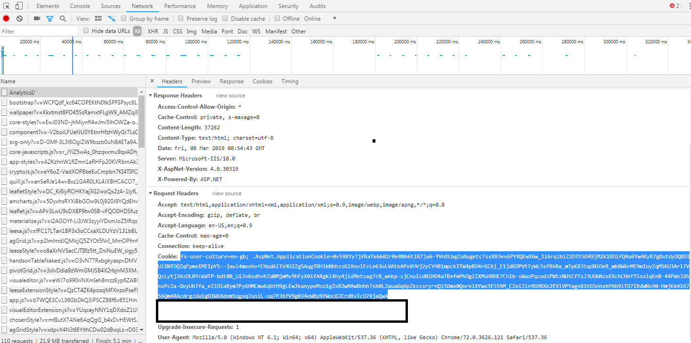

 Quick start template on using nodejs as a development workflow

 ## Getting Started
 These instructions will assist on setting up your development enviroment, and deployment into a giant environment.

 ## Prerequisite:
 - Has access to a version of giant
 - Know what is nodeJs and have [a version installed](https://nodejs.org/en/)

> If you are working in bison environment, copy this link http://nexus.gfx.com:8801/repository/storage/visual-pack/visual-pack-nodejs-sample.zip in your bison environment to download the package. *This download link only valid within bison environment.*


 ## Setup
 1. Download the visual pack sample from this environment
 2. Delete the .git (and setup your own git repo)
 3. Update the below files to your repective values

    - package.json (name, desciption, author)
    - webpack.config.js ('myCustomVisual' 2 places to you visual name)
    - src/program.js ('myCustomVisual' to you visual name)
    - publish/visual/quadrant-properties.js ('myCustomVisual' to you visual name)
    - publish/config.js (install.visualConfig)
    - publish/config.js (install.authcookie, giant web access cookie)
    - publish/config.js (install.giantUrl)

### How to obtain GIANT web access cookie

After logging into GIANT, open web debugger console (press **F12**) and switch to **Network** tab. Select one of the network action at the right panel, look for **Request Headers** of that network action and copy the **Cookie** value. Example of cookie value is shown below: 


## Development Files

| File        | Description            |
| ------------- |-------------|
| publish/visual/icon.png | icon file of custom visual |
| publish/visual/quadrant-properties.html | properties HTML for quadrant configuration      |  
| publish/visual/quadrant-properties.js | javascript for properties HTML, parse by giant during configuration stage
| src/app.js | main rendering of custom visual |
| src/app.scss | main styling of custom visual |
| src/program.js | Development only files. Dump any debugging configuration here for testing purpose |

See [Visual pack documentation](https://github.com/fx-giant/giant-documentations/blob/master/visual/visual-pack.md#quadrant-properties-html-js) for more information about quadrant properties HTML and javascript.

> Protip: for additional scripts/style for your visual pack, add the files in the **src** folder and `import` in the **app.js**.

## How to Run
```
--Installing dependency packages
npm install

--Debug visual application (browser will launch localhost:8080)
npm run debug 

-- Deploy visual pack to GIANT base on configuration
npm run publish

--see package.json for other relevant commands

```
